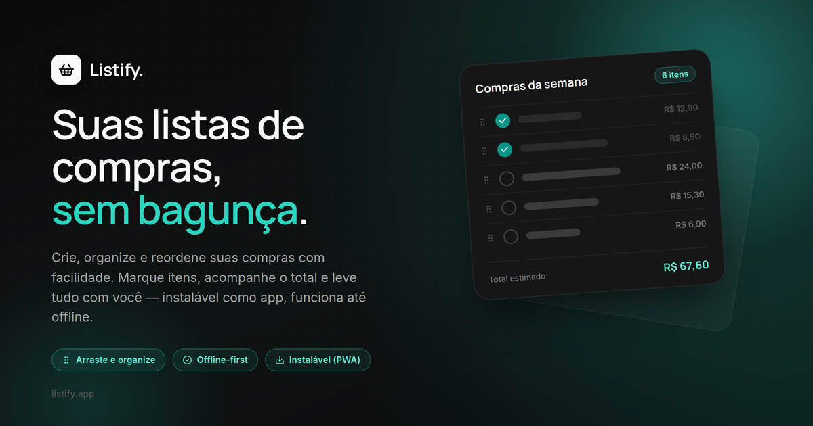

<p align="center">
  
</p>

<p align="center">
  
</p>

<!-- <hr /> -->

<p align="center">
  <strong>Listify</strong><br />
  Suas listas de compras, sem bagunça — offline-first, instalável como app, com leitor de preço por foto via IA.
</p>

<p align="center">
  React Router v7 (framework mode, SPA) · Tailwind CSS v4 · PWA · Gemini AI
</p>

---

## Sobre o projeto

Listify é um app de listas de compras client-first: não há banco de dados, os dados da lista ficam salvos em `localStorage` e o app é instalável como PWA, funcionando mesmo offline. Dá pra criar múltiplas listas, adicionar e reordenar itens por drag-and-drop, marcar itens como comprados e acompanhar o total estimado (e orçamento) em tempo real.

O diferencial é o leitor de preços por foto: usando a API do Google Gemini, o app identifica o preço de um produto a partir da foto da etiqueta de prateleira ou da embalagem, e preenche o valor automaticamente no formulário do item. Essa chamada passa por uma Vercel Function (`api/scan-price.ts`) — o único ponto server-side do projeto, que existe só pra manter a chave do Gemini fora do bundle do cliente.

## Stack

| Camada | Tecnologia |
|---|---|
| Framework | [React Router v7](https://reactrouter.com/) (framework mode, modo SPA — `ssr: false`, dados vivem no client) |
| UI | React 19, Tailwind CSS v4, componentes shadcn-derivados sobre [Base UI](https://base-ui.com/) (`@base-ui/react`, não Radix) |
| Formulários | [Conform](https://conform.guide/) (`@conform-to/react` + `@conform-to/zod`) + Zod |
| Drag-and-drop | [dnd-kit](https://dndkit.com/) (`@dnd-kit/core` + `sortable` + `utilities`) — reordenar itens da lista |
| IA | [Google Gemini](https://ai.google.dev/) (`gemini-3.1-flash-lite`) — leitor de preço a partir de foto, chamado via `api/scan-price.ts` |
| Backend | Vercel Function (`api/scan-price.ts`) — único endpoint server-side, proxy pro Gemini com rate limit por IP (`@vercel/functions`) |
| Tema | `next-themes` (claro/escuro/sistema) |
| Estado de URL | [nuqs](https://nuqs.dev/) — ex.: ordenação dos itens persistida na URL |
| Persistência | `localStorage` (sem banco de dados) |
| PWA | `vite-plugin-pwa` (Workbox) + `@vite-pwa/assets-generator` |
| Analytics | [Vercel Web Analytics](https://vercel.com/docs/analytics) (`@vercel/analytics`) — visitantes/page views, sem cookies |
| Segurança | Headers (CSP, `X-Frame-Options`, etc.) via `vercel.json` |
| Lint/format | [Biome](https://biomejs.dev/) (tabs, aspas duplas, `organizeImports`, `useSortedClasses`) |
| Runtime alvo | Node.js 20 (ver `Dockerfile`) |

## Como rodar localmente

### Pré-requisitos

- Node.js 20+

### 1. Clonar e instalar

```bash
git clone <url-do-repo>
cd listify
npm install
```

### 2. Configurar variáveis de ambiente

```bash
cp .env.example .env
```

| Variável | Descrição |
|---|---|
| `GEMINI_API_KEY` | Chave gratuita do [Google AI Studio](https://aistudio.google.com/apikey), usada pelo leitor de preço por foto (`PriceScanButton`). Sem ela, o app funciona normalmente — só o scanner de preço fica indisponível. |

> Sem prefixo `VITE_` de propósito: a chave só é lida server-side, pela Vercel Function em `api/scan-price.ts` — nunca chega ao bundle do cliente.

### 3. Rodar o dev server

```bash
npm run dev
```

App disponível em `http://localhost:5173` (porta padrão do Vite).

> `npm run dev` (Vite puro) não serve o diretório `/api`. Pra testar o leitor de preço por foto localmente, rode `vercel dev` em vez disso.

## Scripts disponíveis

```bash
npm run dev                 # dev server (Vite + React Router), HMR
npm run build                # build de produção (react-router build)
npm run start                 # serve o build de produção
npm run typecheck              # react-router typegen && tsc — rode após qualquer mudança
npm run format                 # biome format . --write
npm run generate-pwa-assets      # regenera ícones PWA a partir do SVG fonte (pwa-assets.config.ts)
```

Não há script de lint separado nem suíte de testes configurada — não invente um. O Biome cobre format + lint (`biome.json`).

## Estrutura do projeto

```
app/
  routes/            rotas via @react-router/fs-routes (convenção de arquivo, ver abaixo)
  domains/           lógica de domínio (shopping-lists, shopping-list-items)
  shared/
    components/        UI compartilhada — ui/ (shadcn-derivado sobre Base UI), icons.tsx, pwa/
    lib/               utilitários cross-domain (storage.ts, utils.ts, id.ts)
  providers/          providers de app (tema, nuqs, tooltip, toaster)
  root.tsx            layout raiz, ErrorBoundary (404 e erro genérico)
public/
  *.png/*.ico/*.svg     ícones PWA/favicon gerados + logo fonte
api/
  scan-price.ts         Vercel Function — proxy server-side pro Gemini
```

### Rotas

Descobertas automaticamente via `@react-router/fs-routes` — uma pasta/arquivo por rota, `$param` para segmento dinâmico (`lists.$listId` → `/lists/:listId`), `_index` para rota índice, `$` para o catch-all de 404. Modo SPA (`react-router.config.ts` → `ssr: false`): não há servidor de dados, `loader`/`action` viram `clientLoader`/`clientAction` e leem/escrevem em `localStorage`.

### Arquitetura por domínio (`app/domains/*`)

Cada domínio (`shopping-lists`, `shopping-list-items`) segue a mesma estrutura, com um barrel `index.ts` reexportando a superfície pública:

```
app/domains/<dominio>/
  components/     UI do domínio (cards, dialogs, drawers)
  hooks/          hooks React específicos do domínio
  services/       funções que leem/escrevem em localStorage (via shared/lib/storage.ts)
  schemas/        schemas Zod (validação de formulário via Conform)
  types/          tipos do domínio
  utils/          helpers puros, sem I/O (ex.: budget-status.ts, item-totals.ts)
  index.ts        barrel — outras partes do app importam só daqui
```

Outras partes do app importam pelo barrel (`~/domains/shopping-lists`), nunca por caminho interno direto. Imports são sempre absolutos via `~/` (alias para `app/`) — nunca `./` ou `../`.

## Leitor de preço por foto (Gemini)

`app/domains/shopping-list-items/utils/gemini-price-scanner.ts` envia a foto pro endpoint `/api/scan-price` (client) e trata a resposta em erros tipados (`MissingApiKeyError`, `RateLimitError`). A chamada real ao Gemini acontece server-side, em `api/scan-price.ts` (Vercel Function): monta o prompt pedindo o preço unitário em reais como JSON estruturado (`responseSchema`, modelo `gemini-3.1-flash-lite`) e mantém a `GEMINI_API_KEY` fora do bundle do cliente. O resultado passa por uma validação de plausibilidade (`0 < preço < 10000`) antes de voltar pro form — e ainda é revalidado pelo Zod normal do submit.

Como a `GEMINI_API_KEY` é compartilhada por todos os usuários do app, `api/scan-price.ts` aplica um rate limit por IP (5 requisições/minuto, via `ipAddress()` de `@vercel/functions`) pra um único visitante não conseguir sozinho estourar a cota gratuita do Gemini pra todo mundo. É um contador em memória — pega a maior parte do abuso graças à reutilização de instância da Fluid Compute, mas não é um limite distribuído entre regiões.

Cada tentativa de scan dispara um evento `price_scan` no Vercel Analytics (`app/domains/shopping-list-items/hooks/use-price-scanner.ts`) com uma propriedade `result` (`success`, `not_detected`, `rate_limited`, `missing_api_key`, `error`) — dá pra acompanhar uso e taxa de erro do recurso direto no dashboard, sem precisar entrar no Google AI Studio.

## Ícones e UI kit

- **Nunca** importe do `lucide-react` direto em um componente — todo ícone usado no app é re-exportado por nome em `app/shared/components/icons.tsx`. Precisa de um ícone novo? Adicione lá primeiro.
- `app/shared/components/ui/*` são componentes shadcn-derivados, mas rodam sobre [Base UI](https://base-ui.com/) em vez de Radix — composição do tipo "as child" usa a prop `render` (ex.: `<Button render={<Link to="/">...</Link>} />`), não `asChild`.

## PWA e ícones do app

Ícones PWA/favicon são gerados a partir de `public/logo-listify-icon.svg` via `@vite-pwa/assets-generator` (`pwa-assets.config.ts` → `npm run generate-pwa-assets`), e ficam na raiz de `public/` pra casar com os paths esperados pelo manifest (`vite.config.ts` → `VitePWA`) e por `app/root.tsx`. Como o app roda em modo SPA (sem `index.html` próprio pro plugin injetar), o service worker é registrado manualmente a partir de um componente client (`app/shared/components/pwa/register-pwa.tsx`).

## Deploy

### Docker

```bash
docker build -t listify .
docker run -p 3000:3000 --env-file .env listify
```

O `Dockerfile` faz build multi-stage (deps → build → runtime) em `node:20-alpine` e roda `npm run start` no final, servindo `build/server/index.js`.

### Sem Docker

Qualquer plataforma que rode Node 20+ funciona: faça `npm run build` e sirva com `npm run start` (ou `react-router-serve ./build/server/index.js` diretamente). A SPA em si (`build/client`) roda em qualquer host estático — mas o leitor de preço por foto depende da convenção `api/*.ts` da Vercel virar Vercel Function automaticamente; fora da Vercel, isso precisa ser adaptado pro equivalente da plataforma (ou fica sem esse recurso).

## Convenções gerais

- **Nomenclatura de arquivos**: kebab-case em todo lugar, inclusive nomes com múltiplas palavras (`item-price-edit-drawer.tsx`, não `item.price.edit.drawer.tsx`).
- **Imports**: sempre absolutos via `~/` — nunca `./` ou `../`, exceto `./+types/route` dentro de arquivos de rota (gerado por `react-router typegen`).
- **Copy**: sempre pt-BR.
- Antes de criar um util ou schema novo, confira se já não existe algo equivalente em `app/shared/lib/` ou no domínio relevante.
